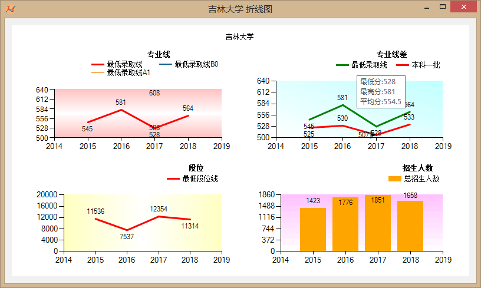

# 高校录取分数分析系统  
>### 实现功能  
>>1. 根据（时间、地区、文理、分数区间、段位区间）字段检索数据库或按照线>差，检索每年的线差范围内数据
>>2. 针对高校，根据每年数据，画出它最低录取分数折线图、线差图、段位图、录取人数图、且要求求出其与之相关的每个专业分数折线图
>>3. 对特殊招生的分数数据，特别标出
>>4. 要求数据可更新(Excel导入更新)
>>5. 折线图分析数据可导出或复制  
>---  
>## 运行环境要求  
>>* Windows 8.1/10
>>* [Microsoft .NET Framework 4.6.2](https://www.microsoft.com/zh-CN/download/details.aspx?id=53344)
>>* Microsoft Office 2010 以上
>>* [SQL server](https://www.microsoft.com/zh-cn/sql-server/sql-server-downloads)
>>* [Microsoft Access 2010 数据库引擎可再发行程序包](https://www.microsoft.com/zh-CN/download/details.aspx?id=13255)   
>---  
>## 数据库建立  
>```sql
>
>use master
>---*** Score Analysis System ***---
>create database SASdatabase
>on primary
>(
>	name = N'SASdatabase',    --一般是数据库的名称
>	filename = N'D:\Program Files\CUST233\SASinfo\SASdatabase\SASdatabase.mdf',--全路径
>	size = 8mb,   --数据文件初始大小
>	maxsize = 1gb, -- 文件最大值
>	filegrowth  = 1mb  --文件增长率
>),
>(
>	name=N'SASdatabase2',    --次要文件名，不能够和主文件同名
>	filename=N'D:\Program Files\CUST233\SASinfo\SASdatabase\SASdatabase2.ndf',
>	size = 8mb,
>	maxsize = 1gb,
>	filegrowth = 10%
>)
>log on  --逻辑文件
>(
>	name=N'SASdatabase_log',  --逻辑文件名，不能和前面的文件同名，一般都是下划线后加一个 log
>	filename = N'D:\Program Files\CUST233\SASinfo\SASdatabase\SASdatabase_log.ldf',--全路径
>	size = 8mb,   --数据文件初始大小
>	maxsize = 1gb, -- 文件最大值
>	filegrowth  = 1mb  --文件增长率
>);
>go
>
>
>use SASdatabase;
>go
>
>if object_id('dbo.SASinfo','U') is not null
>drop table dbo.SASinfo;
>
>create table SASinfo
>(
>	招生地区	nvarchar(8)	default('吉林'),--招生地区，默认吉林
>	学校		nvarchar(128),	--学校
>	时间		int,			--年份
>	专业名称	nvarchar(256),	--专业
>	招生批次	nvarchar(16),	--批次
>	最高分		int,			--最高分
>	最低分		int,			--最低分
>	平均分		float,			--平均分
>	录取数		int,			--录取人数
>	最低位次	int,			--最低位次
>	文理		nvarchar(8),	--文理科
>	autoid		int	primary key identity(0, 1),
>
>	--constraint SASidx primary key(学校, 时间, 专业名称, 录取数, 最低位次),
>
>	check(最高分 >= 0),
>	check(最低分 >= 0),
>	check(最高分 >= 最低分),
>	check(平均分 >= 0),
>	check(录取数 >= 0),
>	check(最低位次 >= 0),
>	check(文理 = '文科' or 文理 = '理科')
>);
>
>use SASdatabase;
>go
>
>if object_id('INS_SAS','tr') is not null
>drop trigger INS_SAS
>go
>create trigger INS_SAS on SASinfo
>instead of insert
>as
>begin
>----------这里获取插入数据的数值----------
>	declare @area		nvarchar(8);
>	declare @school		nvarchar(128);
>	declare @cyear		varchar(8);
>	declare @major		nvarchar(256);
>	declare @batch		nvarchar(16);
>	declare @cupScore	varchar(8);
>	declare @clowScore	varchar(8);
>	declare @cavgScore	varchar(8);
>	declare @cenroll	varchar(8);
>	declare @clowRank	varchar(8);
>	declare @depart		nvarchar(8);
>
>	select @area = 招生地区, @school = 学校,@cyear = 时间, @major = 专业名称, @batch = 招生批次, @cupScore = 最高分, @clowScore = 最低分, @cavgScore = 平均分, @cenroll = 录取数, @clowRank = 最低位次, @depart = 文理
>	from inserted;
>-----------------------------------------------
>	--print(@school);
>	--print(@year);
>	--print(@major);
>-------------------这里转换数据类型-------------------
>	declare @year		int;
>	if @cyear != '-' and len(@cyear) > 0
>		set @year = CAST(@cyear as float)
>	else set @year = 0
>
>	declare @upScore	int;
>	if @cupScore != '-'  and len(@cupScore) > 0
>		set @upScore = CAST(@cupScore as float)
>	else set @upScore = 0
>
>	declare @lowScore	int;
>	if @clowScore != '-'  and len(@clowScore) > 0
>		set @lowScore = CAST(@clowScore as float)
>	else set @lowScore = 0
>
>	declare @avgScore	float;
>	if @cavgScore != '-'  and len(@cavgScore) > 0
>		set @avgScore = CAST(@cavgScore as float)
>	else set @avgScore = 0.0
>
>	declare @enroll		int;
>	if @cenroll != '-'  and len(@cenroll) > 0
>		set @enroll = CAST(@cenroll as float)
>	else set @enroll = 0
>
>	declare @lowRank	int;
>	if @clowRank != '-'  and len(@clowRank) > 0
>		set @lowRank = CAST(@clowRank as float)
>	else set @lowRank = 0
>---------------------这里判重复数据主键---------------------
>	if not exists (select 1 from SASinfo
>					where SASinfo.招生地区 = @area 
>						and SASinfo.学校 = @school
>						and SASinfo.时间 = @year
>						and SASinfo.专业名称 = @major
>						and SASinfo.招生批次 = @batch 
>						and SASinfo.最高分 = @upScore 
>						and SASinfo.最低分 = @lowScore 
>						and SASinfo.平均分 = @avgScore
>						and SASinfo.录取数 = @enroll
>						and SASinfo.最低位次 = @lowRank
>						and SASinfo.文理 = @depart
>					)
>		insert into SASinfo values(@area, @school, @year, @major, @batch, @upScore, @lowScore, @avgScore, @enroll, @lowRank, @depart);
>end
>go
>
>
>use SASdatabase;
>go
>
>if object_id('dbo.Regional','U') is not null
>drop table dbo.Regional;
>
>create table Regional
>(
>	学校		nvarchar(128),
>	地区		nvarchar(8),		--所属地区
>	autoid		int	primary key identity(0, 1),
>);
>
>use SASdatabase;
>go
>
>if object_id('INS_Regional','tr') is not null
>drop trigger INS_Regional
>go
>create trigger INS_Regional on Regional
>instead of insert
>as
>begin
>----------这里获取插入数据的数值----------
>	declare @school		nvarchar(128);
>	declare @area		nvarchar(8);
>	select @school = 学校, @area = 地区 from inserted;
>---------------------这里判重复数据---------------------
>	if not exists 
>	(select 1 from Regional where Regional.学校 = @school and Regional.地区 = @area)
>		insert into Regional values(@school, @area);
>end
>go
>
>
>use SASdatabase
>go
>
>if object_id('dbo.Line','U') is not null
>drop table dbo.Line;
>
>create table Line
>(
>	招生批次	nvarchar(16),
>	文理		nvarchar(8),
>	时间		int,
>	分数线		int,
>	autoid		int	primary key identity(0, 1),
>)
>go
>
>if object_id('INS_Line','tr') is not null
>drop trigger INS_Line
>go
>create trigger INS_Line on Line
>instead of insert
>as
>begin
>----------这里获取插入数据的数值----------
>	declare @bacth		nvarchar(16);
>	declare @depart		nvarchar(8);
>	declare @year		int;
>	declare @score		int;
>	select @bacth = 招生批次, @depart = 文理, @year = 时间, @score = 分数线 from inserted;
>---------------------这里判重复数据---------------------
>	if not exists 
>	(select 1 from Line where Line.招生批次 = @bacth and Line.文理 = @depart and Line.时间 = @year and Line.分数线 = @score)
>		insert into Line values(@bacth, @depart, @year, @score);
>end
>go
>```  
>---  
>## 数据读取写入
>从Excel表格读取高考录取数据  
>**数据格式严格按照上述数据库字段要求，例如 SASdatabase 对应 Excel 格式如下**  
>|招生地区|学校|时间|专业名称|招生批次|最高分|最低分|平均分|录取数|最低位次|文理|
>| --- | --- | --- | --- | --- | --- | --- | --- | --- | --- | --- |
>| 吉林 | 吉林大学 | 2016 | 计算机科学与技术国家二级 | 本科一批 | 633 | 613 | 620 | 45 | 3882 | 理科 |
>| ... | ... | ... | ... | ... | ... | ... | ... | ... | ... | ... |  
>C# 读取Excel需要 OleDb 连接字符串如下  
>注：“HDR=Yes;”指示第一行包含列名称，但不包含数据；“IMEX=1;”指示驱动程序始终将“intermixed”数据列作为文本进行读取。  
>```cs
>int HDR = 1, IMEX = 1;
>string connstring = null;
>if (System.IO.Path.GetExtension(ExcelFilePath).Equals(".xls"))
>connstring = string.Format("Provider=Microsoft.Jet.OLEDB.4.0;Data Source={0};Extended Properties=\"Excel 8.0;HDR={1};IMEX={2:D}\";", ExcelFilePath, HDR, IMEX);
>else if (System.IO.Path.GetExtension(ExcelFilePath).Equalsconnstring = string.Format("Provider=Microsoft.ACE.OLEDB.12.0;Data Source={0};Extended Properties=\"Excel 12.0 Xml;HDR={1};IMEX={2:D}\";", ExcelFilePath, HDR, IMEX);
>```  
>这里需要用到 [Microsoft Access 2010 数据库引擎可再发行程序包](https://www.microsoft.com/zh-CN/download/details.aspx?id=13255)  
>
>C#写入数据库，windows用户验证，连接字符串
>```cs
>static string CONNECTION = @"server = .; database = SASdatabase; Trusted_Connection=SSPI";
>```
>由于数据量达到上w条，采取批量插入方式，利用 SqlBulkCopy 的批量插入方式解决插入速度慢的问题。
>$$
>({批量插入时，只有第一条数据会触发SQL数据库的触发器}_{如果有触发器的话})
>$$  
>
>---  
>## 效果图
>Chart图表
>
